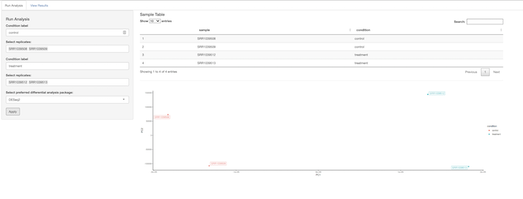
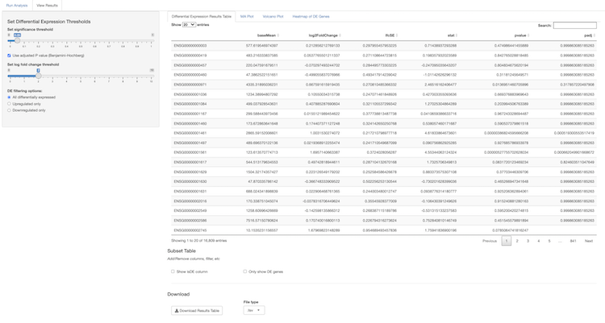

# diffExApp

_An interactive application for differential expression analysis._

## Set up

- This app is set up to run in a specific Docker environment. Most likely you'll be running this application locally so you'll have to make some changes to `app.R`. To switch the application to local, open `app.R` and switch `local <- TRUE`.
- You can now run the app with it's example dataset. A `.csv` derived from the [airway](https://bioconductor.org/packages/release/data/experiment/html/airway.html) dataset.
    - To run the app either click `run app` in the right corner of the RStudio source pane when you have `app.R` open or by running `R -e "shiny::runApp('~/path/to/shinyapp')"` on the command line.

## Usage

Once the application is running, it opens to a tab where you can select replicates and decide on an analysis package (either edgeR or DESeq2). Once everything is set, click the `apply` button and the differential expression analysis will run. You'll see a PCA plot appear underneath the sample table when your results are ready.

The results are on the next tab. On the left hand sidebar, there are thresholds for significance and effect size to determine what is considered differentially expressed. You can view the differential expression results table, an MA plot, a volcano plot, and a clustered heatmap of differentially expressed genes by clicking the tabs on the right hand side. Below each results table or plot there are options for further customization and a download button for that specific result.

